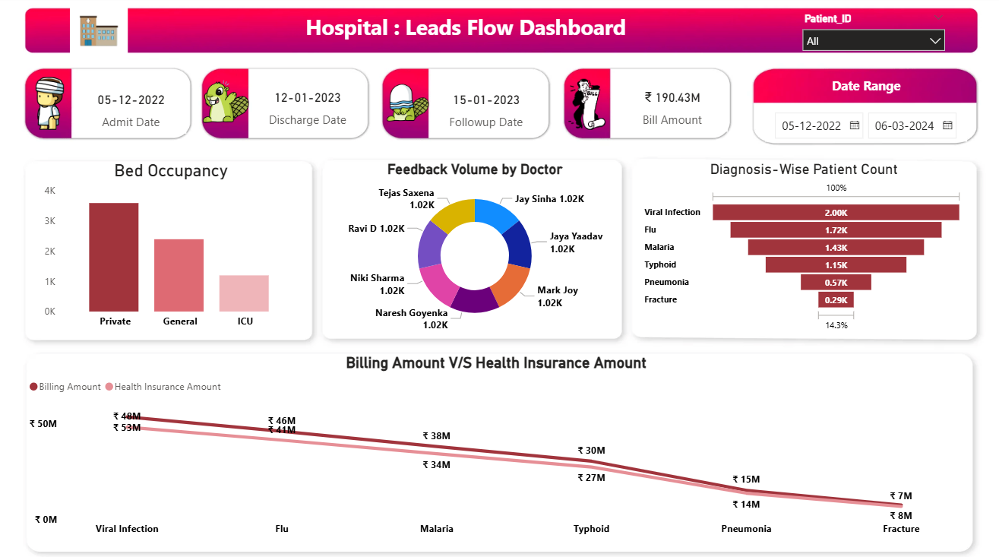

# 🏥 Power BI Project — Hospital Data Analysis

A Power BI dashboard designed to analyze hospital operations, patient flow, doctor feedback, and financial performance.  
This project provides end-to-end insights using real-world style healthcare data.

---

## 📊 Dashboard Preview

---

## 📌 Project Overview

This dashboard covers key metrics related to:

- Patient admission, discharge & follow-up timelines  
- Bed occupancy by category (Private, General, ICU)  
- Doctor-wise feedback volume  
- Diagnosis trends across the hospital  
- Billing vs Health Insurance payout comparison  

It helps hospital administrators quickly understand performance, financial balance, and patient distribution.

---

## 🗂️ Folder Structure

01_Data/ → Source dataset
02_Dashboard/ → Power BI (.pbix) file
03_Images/ → Dashboard screenshots
README.md → Project documentation

---

## 🔍 Key Insights

### **1️⃣ Bed Occupancy Analysis**
- Private beds have the highest utilization  
- ICU has the lowest — indicating fewer critical cases  

### **2️⃣ Doctor Feedback Analysis**
Feedback volume distributed among doctors such as:  
- Jay Sinha  
- Jaya Yaadav  
- Tejas Saxena  
- Mark Joy  
…and others.

Each handles a similar volume, showing balanced load distribution.

### **3️⃣ Diagnosis-wise Patient Count**
Most common diagnoses:  
1. Viral Infection  
2. Flu  
3. Malaria  
4. Typhoid  
5. Pneumonia  
6. Fracture  

Viral Infection & Flu dominate hospital visits.

### **4️⃣ Billing vs Insurance Comparison**
A diagnosis-wise breakdown of:  
- Total billing generated  
- Insurance amount claimed  

Shows which treatments rely more on insurance.

---

## 🧠 Skills & Concepts Demonstrated
- Power BI Data Modeling  
- DAX Calculations  
- Data Cleaning & Transformation  
- Healthcare KPI Development  
- Interactive Dashboard Design  
- Storytelling with Data  

---

## 🧰 Tools Used
- **Power BI Desktop**  
- **Microsoft Excel**  
- **DAX**  
- **Data Visualization Techniques**  

---

## ✍️ Author
**Gulbaaz**  
DTU’22 | Data & Business Analyst | SQL, Power BI, Excel Projects on GitHub  
📫 [GitHub Profile](https://github.com/Gulbaaz)

